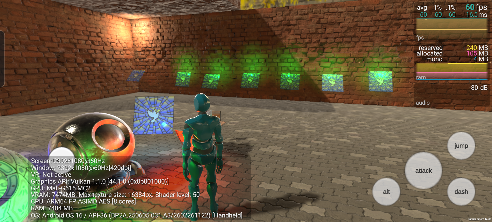

Kage Render Pipeline
====================

**KageRP** is a custom scriptable render pipeline built on Unity's SRP, designed as a flexible renderer base for
personal graphics projects and experimentation.

Overview
--------
KageRP uses a **hybrid Forward+Deferred** approach for rendering opaque geometry, balancing performance with lighting
flexibility:

- **ForwardGBufferPass** - evaluates the main directional light and writes results into the primary HDR target, while
  simultaneously populating a slim GBuffer.
- **DeferredLightingPass** - processes additional lights (point, spot, etc.) using the GBuffer data.

This keeps the primary light cost in the forward pass (avoiding a full deferred resolve for a single light) while still
enabling efficient multi-light deferred evaluation.

GBuffer Layout
--------------
<table>
  <thead>
    <tr>
      <th align="left"></th>
      <th align="center"><code>    R    </code></th>
      <th align="center"><code>    G    </code></th>
      <th align="center"><code>    B    </code></th>
      <th align="center"><code>    A    </code></th>
      <th align="center">Format / Bits</th>
    </tr>
  </thead>
  <tbody>
    <tr>
      <td><strong>GBuffer0</strong></td>
      <td align="center" colspan="3">ForwardLit + Emission</td>
      <td align="center"><em>Unused</em></td>
      <td align="center"><code>RGB111110Float</code></td>
    </tr>
    <tr>
      <td><strong>GBuffer1</strong></td>
      <td align="center" colspan="3">Albedo (RGB)</td>
      <td align="center">AO</td>
      <td align="center"><code>R8G8B8A8</code></td>
    </tr>
    <tr>
      <td><strong>GBuffer2</strong></td>
      <td align="center" colspan="2">NormalVS.xy</td>
      <td align="center">LinearDepth</td>
      <td align="center">Metallic & Roughness</td>
      <td align="center"><code>ARGBHalf</code></td>
    </tr>
    <tr>
      <td><strong>Depth</strong></td>
      <td align="center" colspan="4">Depth_Stencil</td>
      <td align="center"><code>D24_UNorm_S8_UInt</code></td>
    </tr>
  </tbody>
</table>

> **GBuffer2** stores view-space normals as XY components (Z is reconstructed), linear depth for position
> reconstruction, and packed metallic/roughness in the alpha channel.

Notes
-----

- Designed for experimentation and learning rather than production use

License
-------
This project is MIT License - see the [LICENSE](LICENSE) file for details